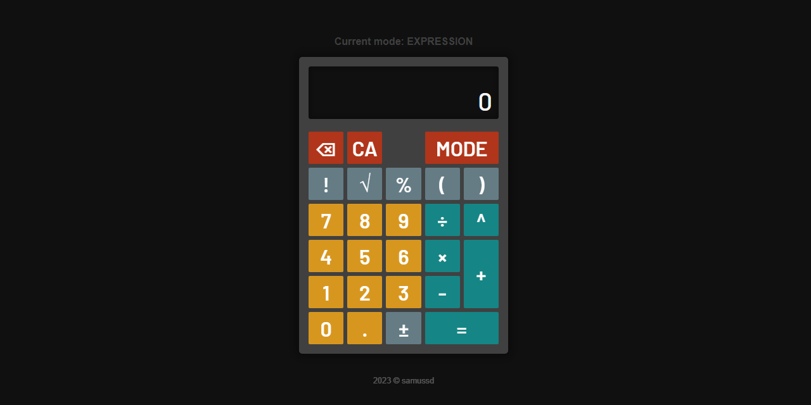

<h1 align="center">Calculator</h1>

    

<h4 align="center"><a href="https://samussd.github.io/calculator/">Live site</a></h4>

---

## About
A simple calculator app. Part of The Odin Project.  
It has keyboard support for most operations.  
This calculator has 2 modes:  
- Simple mode: allows only one operation at a time on the display.
- Expression mode: the user can type an expression, including parentheses.

---
## Used technologies
The technologies used for the development of this application were:

- JavaScript
- HTML
- CSS
